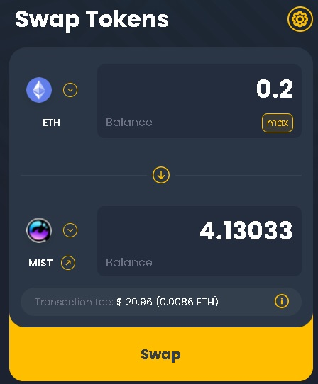

# 獲取和提供

### 1. 獲取$MIST ⚗️ 

您在mistX.io上進行過代幣交易嗎？如果有的話，你已經知道如何做了。


我們建議使用 mistX.io 交易$MIST。但如果你選擇使用Uniswap, 請緊記由於**Uniswap V3**的流動性較低，額外的差價可能意味著你將無法獲得最佳的購買價格。請使用我們這個[Uniswap V2](https://app.uniswap.org/#/swap?outputCurrency=0x88acdd2a6425c3faae4bc9650fd7e27e0bebb7ab&use=V2)連結來進行代幣交易。


1. 到 [mistX.io 交易$MIST](http://swap.mist.alchemist.wtf)
2. 連接您的MetaMask錢包
3. 您應該看到如下內容：

    

4. 輸入您想購買⚗️的數量，請確保你有多於所需的ETH。\(給gas費和往後提供LP\)
5. 點擊 "SWAP"，通過MetaMask進行必要的授權，等待交易完成。
   * mistX 可以通過點擊設置圖標並選擇支付更高的交易費用來提高交易的成功率。
6. 前往[https://etherscan.io/address/](https://etherscan.io/address/上查看與您的賬戶相關的待處理交易和所有代幣。)查看你的帳戶，你可以看到正在等待的交易和內裏的所有代幣。

   * 如果您使用MetaMask，您可以點擊那個三點的圖標，然後點擊"View on Etherscan"：

     

7. 您應該會看到現在屬於你的⚗️如下所示：

 

### 2. 提供$MIST ⚗️以獲取LP代幣

您有否曾經在Uniswap上提供過流動性資金\(liquidity\)嗎？如果有，你已經知道如何做了。


Crucible只支持**Uniswap V2**流動資金池。 向**Uniswap V3**資金池添加流動性並不能參與獎勵計劃。


1. 前往 [Uniswap V2 提供$MIST LP](https://app.uniswap.org/#/add/v2/0x88acdd2a6425c3faae4bc9650fd7e27e0bebb7ab/ETH)
   * 如果還沒有連接MetaMask錢包，請先連接MetaMask錢包
2. 您可以看到如下內容：

    

3. 輸入你想押的數量。兩者需要相等，所以調整一方的數量就會改變另一方的數量。你可能想點擊⚗️上的“MAX”按鈕來輸入你全部的數量。請確保你有多於所需的ETH。
4. 點擊“Stake”或“Supply”，通過MetaMask進行必要的授權，等待交易完成
5. 您應該可以再次在Etherscan上看到您的新LP代幣（名為UNI-V2\):

    

## 

