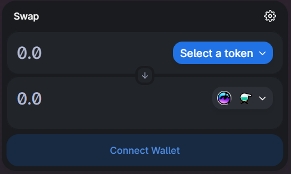

# Acquiring $MIST ⚗️

### &#x20;Getting $MIST ⚗️

Ever traded coins on mistX.io? If so you know how to do this already.


We recommend using mistX.io when trading $MIST. However, if you decide to use Uniswap, please note that due to low liquidity on **Uniswap V3**, extra slippage might mean you will not get the best price for your purchase. Please use this [**Uniswap V2**](https://app.uniswap.org/#/swap?outputCurrency=0x88acdd2a6425c3faae4bc9650fd7e27e0bebb7ab\&use=V2) **** link to perform the token swap using Uniswap.


1. Head to [Uniswap](https://app.uniswap.org/#/swap?outputCurrency=0x88acdd2a6425c3faae4bc9650fd7e27e0bebb7ab\&use=V2\&chain=mainnet)
2. Connect MetaMask wallet
3. You should see something like this:\
   
4. Enter the amount of ⚗️ you wish to purchase, ensuring you have an equivalent value of ETH remaining to use for the subscribing
5. Hit "Swap", make necessary approvals via MetaMask, wait for the transaction to complete
   * mistX has the ability to let you increase the success rate of a transaction by clicking the Setting icon and choosing to pay a higher transaction fee.
6. Navigate to [https://etherscan.io/address/](https://etherscan.io/address/) to view pending transactions and all tokens associated with your account.
   *   if you use MetaMask you can click the triple dots and then "View on Etherscan" to jump to it:

       
7.  You should see your new ⚗️ displayed like the following:

    &#x20;

##
