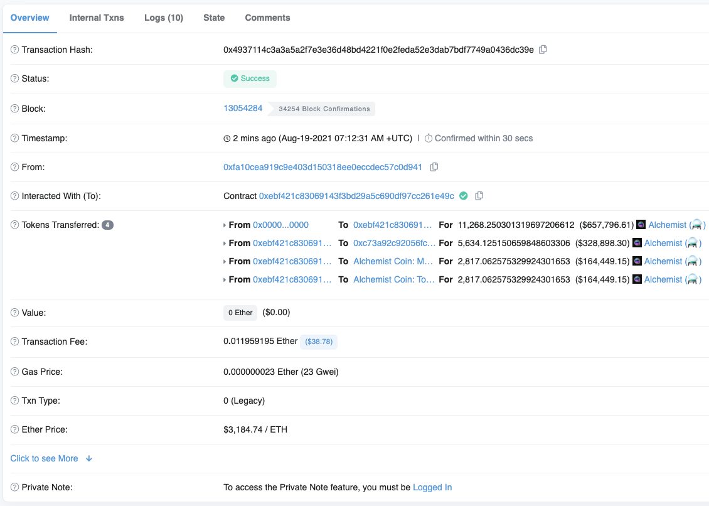

# Guide: Inflation

## What is Inflation?

Since inception of the Alchemist project and the ⚗️ token, our token supply has been configured to increase the circulating supply by 1% every 14 days.

This process is managed by our `StreamV2` contract. The `StreamV2` contract is responsible for interacting with our ⚗️ token contract in order to mint the tokens and then distribute them to the correct destinations.

At current the distribution of inflation is divided into 3 pieces:

1. `50%` is distributed to the [Aludel v1.5](https://etherscan.io/address/0x93c31fc68E613f9A89114f10B38F9fd2EA5de6BC) \([Crucible Documentation](https://docs.alchemist.wtf/crucible)\)
2. `25%` is distributed to the [Multi-sig](https://etherscan.io/address/multisig.alchemistcoin.eth)
3. `25%` is distributed to the [Treasury](https://etherscan.io/address/0x1c428a75181bc25509af3a5b7faee97b4b6d3562)

The `StreamV2` contract is permissionless, this means that once the 14 days have passed since the previous inflation, anyone can make the contract call to mint and distribute the tokens.

## How to call inflation?

Inflation can be called by invoking the `advanceAndDistribute()` function on the `StreamV2` contract located at `0xebf421c83069143f3bd29A5C690Df97CC261E49c` - [View on Etherscan](https://etherscan.io/address/0xebf421c83069143f3bd29A5C690Df97CC261E49c)

Calling inflation is quite a straight forward event, but before attempting to call it you must ensure the following:

1. Make sure the last time the `Advanced and Distribute` function was successfully called more than 14 days ago.
2. Ensure that the previous transaction that you're using for reference was a successful one and does not show an orange warning symbol.

**Here is an example of a failed call \(orange warning symbol\):** 

**Here is an example of when to know that it's safe to call inflation:** 

Once you're ready to call inflation, the easiest way to do so is to do it via [Etherscan](https://etherscan.io/address/0xebf421c83069143f3bd29A5C690Df97CC261E49c#writeContract) using the `Write Contract` section.

### Calling Inflation

First of all you will need to connect your wallet, click the `Connect to Web3` button on [this page](https://etherscan.io/address/0xebf421c83069143f3bd29A5C690Df97CC261E49c#writeContract) and then connect your wallet.

You will want to locate the `advanceAndDistribute` function, expand it by clicking on it.

Once you've expanded it and are ready to call inflation, click the `Write` button, this will trigger a transaction on your wallet.

Confirm the transaction and the process should start.

Once your transaction has been successful, you should be able to see the transaction appear on the `StreamV2` Transaction log. If you view the transaction you should be able to see something similar:

Congratulations! You've now called inflation and funded the Aludel reward program, Multisig and Treasury.

### Important Addresses

These address are up-to-date at the time of writing. You can refer to our [GitHub page](https://github.com/alchemistcoin/alchemist) for a more comprehensive list of addresses.

| Contract Address | Description |
| :--- | :--- |
| `0xebf421c83069143f3bd29A5C690Df97CC261E49c` | StreamV2 |
| `0x93c31fc68E613f9A89114f10B38F9fd2EA5de6BC` | Aludel v1.5 |
| `0xF3e48a2b1b9808f66321FB1Eb385C86d2486dd6A` | Multisig |
| `0x1c428A75181Bc25509aF3A5B7FAEE97b4B6d3562` | Treasury |

