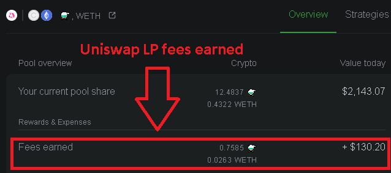

# FAQ 📖

## **אנא צפה בסרטון זה על הפסד בלתי קבוע לפני שתמשיך**



## כיצד אוכל להשתתף ב- Aludel / כיצד אוכל לבצע מינט ל- NFT של כור היתוך?


הכור היתוך תומך רק בבריכת הנזילות של **Uniswap V2**. הוספת נזילות לבריכת של **Uniswap V3** אינה תואמת לתכנית התגמולים.



**אמצעי זהירות**

אל תשתמש בדפדפן Brave מכיוון שהוא אינו תואם לתהליך בשלב זה והעסקה שלך תיכשל וכתוצאה מכך אבדות עמלות. 

אנו לא ממליצים להשתמש בארנק חומרה בשלב זה מכיוון שרבים אינם תומכים כעת בחתימת EIP-712. כאשר הם יתקנו זאת, נוכל ליישם ולהוסיף זאת. 

חלק מהמשתמשים דיווחו על בעיות עם Trustwallet. 

אנו לא ממליצים לך לעשות זאת בנייד.


Please use one of the guides below to mint a crucible

* [Minting a Crucible on crucible.alchemist.wtf](guides-crucible.alchemist.wtf/)

## **Why can’t I see my ⚗️Mist in my wallet?**

You can add the contract address **`0x88acdd2a6425c3faae4bc9650fd7e27e0bebb7ab`** to make them visible.  
Token Symbol: ⚗️  
Token Decimal: 18

## **Why can’t I see my LP in my wallet?**

You can add the contract address **`0xcd6bcca48069f8588780dfa274960f15685aee0e`** to make them visible.  
Token Symbol: UNI-V2  
Token Decimal: 18

## **Why can’t I see my Crucible in my wallet?**

You can add the contract address **`0x54e0395CFB4f39beF66DBCd5bD93Cca4E9273D56`** to make your Crucible\(s\) visible.  
Token Symbol: CRUCIBLE-V1  
Token Decimal: 0

## **What are the rewards for Subscribing in the Aludel?**

Rewards are distributed from the reward pool proportionally to the amount and duration of a Subscription. The more ⚗️$mist/ETH Uniswap LP tokens you Subscribe and the longer you leave it for, the more rewards it will accumulate. The Aludel reward program is designed to reward long term participants.

You can see the reward pool [here.](https://etherscan.io/address/0x04108d6e9a51bec5170f8fd953a156cf754ba541)

## **How do I become an certified Alchemist in Discord?**

* Please use this [guide](how-to-become-a-certified-alchemist-on-discord.md)
* Join Discord
* Go to the Welcome channelType !join
* You will then get a message from the Collab.Land bot
* Connect Your wallet containing your ⚗️$mist
* The bot will then message you  ~ Updating roles, Please check assigned roles in Alchemist
* Close bot and return to the main alchemy channel and you will now be a certified Alchemist!

## **How do I claim the rewards?**

All rewards are received when you "[Claim Rewards and Unsubscribe LP](guides-crucible.alchemist.wtf/claiming-rewards-and-unsubscribing-your-lp.md)". Be careful, this also resets your reward multiplier. 

## **Does it matter how many LP tokens go into the Crucible?**

The more LP tokens you get the higher amount of liquidity you provided therefore a larger percentage of the rewards pool you will receive. There is no minimum LP required, but we do suggest you be mindful of the ethereum gas cost when considering this.

### **Is it more advantageous to have more Crucibles or a higher Subscription in one Crucible?**

It’s almost always better to accumulate LP in a single Crucible as it minimizes the gas costs.

The only time you would use multiple Crucibles is if you aim to transfer / sell a Crucible with some active Subscription on it.

## What is the maximum number of crucibles that can be created? 

An unlimited number of crucibles can be created. Please note that if you visit [etherscan, ](https://etherscan.io/token/0x54e0395cfb4f39bef66dbcd5bd93cca4e9273d56)please disregard the word "Max" in "Max Total Supply" because the supply is unlimited. The "Max Total Supply" shown on etherscan simply indicates the total number crucibles created so far.

## **How does "Claim Rewards and Unsubscribe LP" impact the reward multiplier?**

Every time you put LP tokens in the Aludel reward program, it keeps track of how long those tokens are Subscribed. The Aludel applies a reward multiplier which starts at 1x and increases to 10x over 60 days. When you claim a partial amount, the Aludel first claims from the Subscription with the lowest multiplier \(Last In, First Out\).

## **Can I somehow see how much rewards I have acquired in the meantime?**

You can see the accumulated reward for your crucible by using the UI at either [crucible.alchemist.wtf](https://crucible.alchemist.wtf/) and the accumulated Uniswap LP fees earned using [apy.vision](https://apy.vision/) or [croco.finance](https://croco.finance/) \(Uniswap LP fees earned will show as ⚗️, and WETH or ETH\).

## **Can I add more LP to an existing Crucible?**

Yes. The gas for adding more LPs to your current Crucible will be much lower than when you initially minted a Crucible. Each Subscription event is independent, so any LP you add will start their own multiplier independently.

## **Does “Claim Rewards and Unsubscribe LP” remove my LP & rewards from the Crucible?**

No. This only claims the rewards earned, your LP will remain in the Crucible until you “Withdraw Unsubscribed LP”.

## **Does “Withdraw Unsubscribed LP” destroy the Crucible?**

No, it only empties it. You retain the empty Crucible.

## **Can I transfer the Crucible NFT to another wallet?**

Yes, the ownership of the NFT \(and the Subscribed LP tokens\) can be transferred to any ERC721 compatible wallet. This can be done via the "Transfer Crucible" button on [crucible.alchemist.wtf](https://crucible.alchemist.wtf/)

## **If I transfer my Crucible from one wallet to another will that reset the multiplier?**

No, as long as the rewards are not unsubscribed from the Aludel.

## **אנא צפה בסרטון זה על הפסד בלתי קבוע לפני שתמשיך**



**? Crucible NFT -ל Mint איך אני עושה / Aludel -כיצד אוכל להשתתף ב**

שלך Crucible NFT -ל mint אתה צריך לעשות ,Aludel -כדי להשתתף ב ⚗️$mist/ETH Uniswap LP tokens ולהפקיד לתוכו קצת \(חשוב על זה כעל כספת וירטואלית\) .שמנויים LPביחס לכמות ומשך אסימוני ה Aludel צובר תמלוגים מתוכנית Crucible -ה והמנוי תלויה במחירי הגז הנוכחיים של האתריום, Crucible -ל minting העלות כדי לעשות .ETH ניתן לצפות שזה יהיה בערך 0.1-0.2

**:מידע חשוב**

**מכיוון שהוא אינו תואם לתהליך בשלב זה והעיסקה שלך תיכשל Brave אל תשתמש בדפדפן** **.וכתוצאה מכך תאבד את העמלות**

**.EIP-712 אנו לא ממליצים להשתמש בארנק חומרה בשלב זה מכיוון שרבים אינם תומכים כעת בחתימת** **.כאשר הם יתקנו זאת, נוכל ליישם זאת**

**.Trustwallet חלק מהמשתמשים דיווחו על בעיות עם**

**אנו לא ממליצים לך לעשות זאת בנייד**

1. [https://crucible.alchemist.wtf/](https://crucible.alchemist.wtf/) ,היכנסו לאתר crucible -עבור ה mint כדי לבצע
2. שלך MetaMask -חבר את ארנק ה
3. Crucible -שאתה מעוניין להכניס לתוך ה LP -הזן את כמות ה
4. “Mint Crucible and Subscribe LP to Aludel” הקלק על .חתום עליהם והמתן לסיום ,MetaMask -אתה תקבל 2 הודעות קופצות מ
5. 0.1-0.2 Eth לאחר מכן תתבקש לאשר את העסקה, בדרך כלל זה עולה באיזור Crucible כדי ליצור .אם אתה מרוצה מתעריפי הגז, לחץ על אשר והמתן לביצוע העסקה
6. החדש שלך Crucible -לאחר שהפעולה הושלמה תראה את ה Etherscan -ב Erc721 בכרטיסיית האסימונים

 **?שלי בארנק ⚗️Mist מדוע איני יכול לראות את ה**

אתה יכול להוסיף את כתובת החוזה **0x88acdd2a6425c3faae4bc9650fd7e27e0bebb7ab** .כדי להפוך אותם לגלויים  
⚗️ ****:Token Symbol  
Token Decimal: 18

**?שלי בארנק LP מדוע איני יכול לראות את ה**

אתה יכול להוסיף את כתובת החוזה **0xcd6bcca48069f8588780dfa274960f15685aee0e** .כדי להפוך אותם לגלויים  
Token Symbol: UNI-V2  
Token Decimal: 18

**?שלי בארנק Crucible מדוע איני יכול לראות את ה**

אתה יכול להוסיף את כתובת החוזה **0x54e0395CFB4f39beF66DBCd5bD93Cca4E9273D56** .שלך לגלוי Crucible -כדי להפוך את ה  
Token Symbol: CRUCIBLE-V1  
Token Decimal: 0

**?Aludel -מהם התגמולים עבור הרשמה ל**

.תגמולים מחולקים ממאגר התגמולים באופן יחסי לכמות ומשך ההרשמה ,רשומים וככל שאתה משאיר אותם זמן רב יותר ⚗️$mist/ETH Uniswap LP tokens ככל שיש לך יותר .כך הם יצברו יותר תגמולים  
.נועדה לתגמל משתתפים לטווח הארוך Aludel תוכנית התגמול של

[כאן](https://etherscan.io/address/0x04108d6e9a51bec5170f8fd953a156cf754ba541) אתה יכול לראות את מאגר התגמולים

**?Discord -כיצד אוכל להיות אלכמאי מוסמך ב**

* [guide](https://alchemist-docs.gitbook.io/alchemist/crucible/how-to-become-a-certified-alchemist-on-discord) אנא השתמש במדריך
* Discord -הצטרף ל
* והצטרף אליו Welcome עבור לערוץ
* Collab.Land לאחר מכן תקבל הודעה מהבוט
* שלך ⚗️$mist חבר את הארנק שלך שמכיל את ה
* Updating roles, Please check assigned roles in Alchemist הבוט יעביר לך הודעה 
* !וכעת תהיה אלכימאי מוסמך alchemy סגור את הבוט וחזור לדף הראשי בערוץ של 

**?כיצד אוכל לתבוע את התגמולים**

"[Claim Rewards and Unsubscribe LP](guides-crucible.alchemist.wtf/claiming-rewards-and-unsubscribing-your-lp.md)" כל התגמולים מתקבלים כאשר אתה לוחץ על .היזהר, זה גם מאפס את מכפיל התגמול שלך כאשר אתה עושה זאת בכדי למנוע מבוטים להריץ את 

**?Crucible -נכנסים ל LP tokens האם זה משנה כמה**

כמות הנזילות שאתה מספק תגדל ולכן תקבל גם אחוז גדול יותר ממאגר התגמולים LP tokens ככל שתקבל יותר .אך אנו ממליצים שתזכור את עלות גז האתריום שאתה שוקל זאת LP -לא קיימת דרישת מינימום ל

**?אחד Crucible -או הרשמה גבוהה יותר ב Crucible האם יש יתרון בלהחזיק יותר**

.יחיד מכיוון שהוא ממזער את עלויות הגז Crucible -ב LP כמעט תמיד עדיף לצבור

היא multiple Crucibles -הפעם היחידה בה אתה משתמש ב

.עם מנוי פעיל כלשהו Crucible אם אתה שואף למכור / להעביר

**?על מכפיל התגמול "Claim Rewards and Unsubscribe LP" כיצד משפיע**

,Aludel לתוכנית התגמול של LP בכל פעם שמכניסים אסימונים של .זה עוקב אחרי משך הזמן שרשומים לאסימונים האלה .מתחיל מכפיל תגמול שמתחיל פי 1 ומגדיל פי 10 מעל 60 יום Aludel -ה .\(Last In, First Out\) תובע תחילה מהמנוי עם המכפיל הנמוך ביותר Aludel כאשר תובעים סכום חלקי

**?האם אני יכול איכשהו לראות כמה תגמולים רכשתי בינתיים**

שלך באמצעות ממשק המשתמש באתר crucible אתה יכול לראות את התגמולים המצטברים עבור ה [crucible.alchemist.wtf](https://crucible.alchemist.wtf/)  
:באמצעות אחד מהאתרים כאן Unuswap שנצברו על ידי LP -ובעמלות ה [apy.vision](https://apy.vision/) [croco.finance](https://croco.finance/) \(Uniswap LP fees earned will show as ⚗️, and WETH or ETH\)

**?הקיים Crucible -ל LP האם אוכל להוסיף עוד**

הנוכחי שלך יהיה נמוך בהרבה מאשר בהתחלה שביצעת את ה crucible -ל LP כן. הגז להוספת יותר  
.שלך crucible -ל mint .שתוסיף יתחיל מכפיל משלו באופן עצמאי LP כל אירוע הרשמה הוא עצמאי, כך שכל

**?Crucible -והתגמולים שלי מה LP -מסיר את ה “Claim Rewards and Unsubscribe LP” האם**

.לא עד שאתה מבצע crucible שלך ישאר בתוך ה LP זה תובע רק את התגמולים שהרווחת ה  
“Withdraw Unsubscribed LP”

**?Crucible -משמיד את ה “Withdraw Unsubscribed LP” האם**

.הריק Crucible -לא, זה רק מרוקן אותו. אתה שומר את ה

**?לארנק אחר Crucible NFT -האם אוכל להעביר את ה**

ERC721 -לכל ארנק תואם ל \(הרשומים LP -ואסימוני ה\) NFT -כן, ניתן להעביר את הבעלות על ה שנמצא כאן "Transfer Crucible" ניתן לעשות זאת באמצעות כפתור [crucible.alchemist.wtf](https://crucible.alchemist.wtf/)

**?שלי מארנק אחד למשנהו האם זה יאפס את המכפיל Crucible -אם אני מעביר את ה**

.Aludel -לא כל עוד התגמולים אינם רשומים ב

