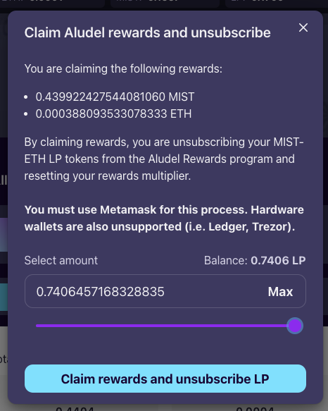
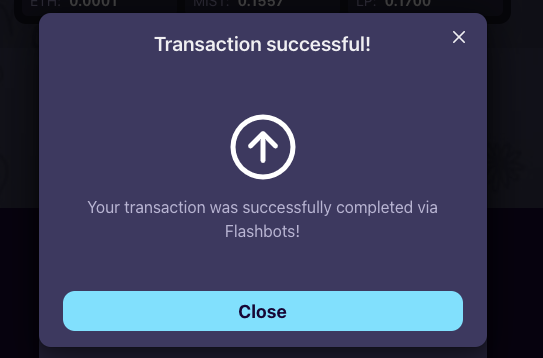

# Preuzimanje nagrade & otkazivanje pretplate LP

U nekom trenutku ćeš poželeti da prikupiš svoje nagrade i otkažeš pretpletu prikupljenih LP tokena sa svog Crucible-a.

Vodič koji sledi će ti pokazati kako da prođeš kroz ceo proces korak po korak:


Please note that after claiming your rewards and unsubscribing your LP, you will no longer receive rewards from the Aludel reward program. To receive rewards again please follow the guide below, then withdraw your LP using the "Withdraw unsubscribed LP" button, and then subscribe your LP using the "Increase LP subscription" button.


1. Otvori [crucible.alchemist.wtf](https://crucible.alchemist.wtf/), poveži svoj wallet i poseti "Your Crucibles" tab.
2. Kada pređeš na "Your Crucibles" tab, proširi detalje o Crucible-u, sa kojeg želiš da skineš nagradu i otkažeš pretplatu LP tokena, tako što ćeš da klikneš na strelicu koja je okrenuta na dole:

   

3. Tvoj Crucible bi sada trebao da ti prikaže dodatne informacije, na primer koliko MIST ili ETH si zaradio u nagradama 

   

4. Klikni na "Manage Crucible" dugme  

   

5. Sada bi trebalo da se prikaže još kompleksnija statistika, u okviru "Rewards" taba.   
6. Klikni na "Claim rewards and unsubscribe" u dnu strane  

   

7. Upiši koliko LP tokena otkazuješ sa pretplate i klikni na "Claim rewards and unsubscribe LP". 
8. Sada će se pojaviti pop up box sa MetaMask koji te pita za “Signature Request”, a ti onda klikni na “sign”. 

    

   prvi zahtev za potpis

    ​ 

   drugi zahtev za potpis

9. Cena Gasa ce biti automatski izracunata na sajtu u odnosu na trenutnu cenu gasa. Ova cena ce biti izabrana u vase ime kao deo transakcije za preuzimanje nagrada
10. Dobices poruku da je tvoje preuzimanje zapoceto preko Flashbots-a. Time su transakcije zasticene od frontrunner-a. Ovaj proces moze trajati i do pet minuta.

    

  
  
    Ukoliko nemas dovoljno ETH-a u novcaniku dobicete ovakvu poruku.  
    

11. Ukoliko je transakcija uspesna dobicete ovakvu poruku.   Zbog prirode gomilanja transakcija moguce je da transakcija nece biti uspesna prvi put. Ako se to dogodi pokusajte ponovo. Provizija za gas ce biti naplacena samo ako je transakcija uspela. 

