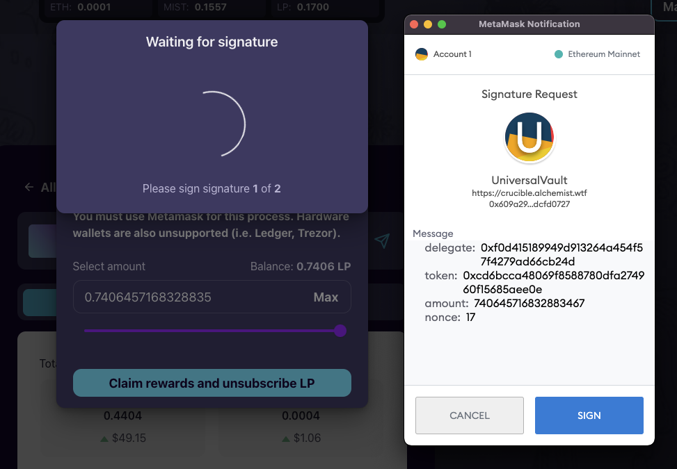
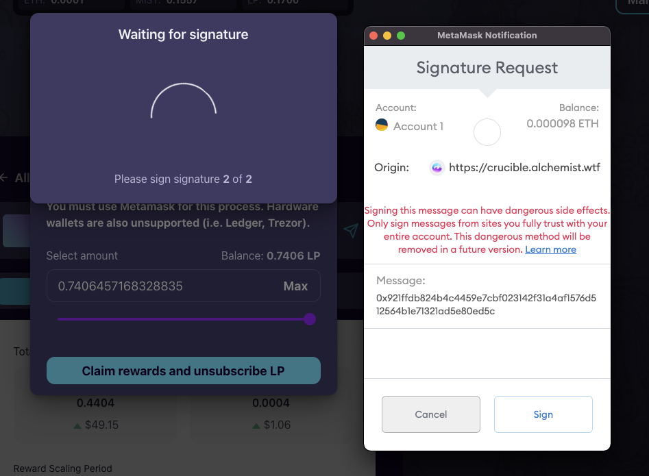
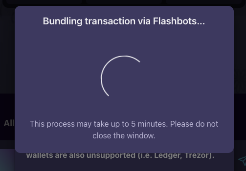
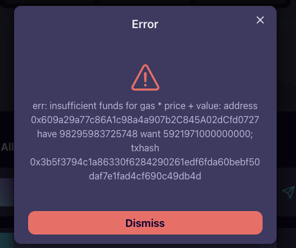
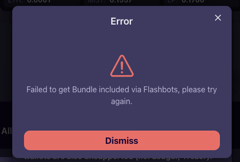

# Récupérer les récompenses & Désengager vos LP

À un moment donné, vous pouvez décider que vous êtes prêt à récupérer vos récompenses et à désengager vos LP de votre Crucible.

Le mode d'emploi ci-dessous vous guidera pas à pas dans ce process. 

1. Ouvrez [crucible.alchemist.wtf](https://crucible.alchemist.wtf/), connectez votre wallet et ouvrez l'onlget "Your Crucibles".
2. Une fois sur l'onglet "Your Crucibles", affichez les détails du Crucible pour lequel vous souhaitez récupérer les récompenses et désengager les LP, en cliquant sur la flèche pointant vers les bas.  
3. Votre Crucible devrait maintenant vous afficher davantage d'informations, telles que le nombre de MIST ou d'ETH gagnés en récompenses.  
4. Cliquez sur le bouton "Manage Crucible"  
5. Vous devriez alors voir une liste plus complexe de statistiques sous l'onglet "Rewards".   
6. Cliquez sur "Claim rewards and unsubscribe" en bas de la page.  
7. Renseignez le champ avec la quantité de LP que vous souhaitez désengager puis cliquez sur "Claim rewards and unsubscribe LP".  

   1. 

 

8. Deux pop-up Metamask s'affichent successivement vous demandant une "Signature Request" cliquez sur "Sign" à chaque fois.  

      
   Première "Signature Request"

  

     
   Seconde "Signature Request"

  

9. Le coût du gas sera automatiquement calculé par le site Web sur la base du tarif actuel du gas. Ce calcul sera soumis en votre nom dans le cadre de la transaction de demande de récompenses.

10. Vous recevrez alors un message vous indiquant que votre demande est actuellement soumise via Flashbots, ceci pour protéger vos récompenses des frontrunners. Le process peut prendre jusqu'à 5 minutes.

      
  
    Si vous n'avez pas suffisamment d'ETH dans votre wallet pour la transaction, vous recevrez le message suivant.  
      

11. Si votre transaction réussit vous recevrez le message suivant   En raison de la nature des transactions groupées \(bundling transactions\), il est possible que la transaction ne soit pas réussie lors de votre première tentative. Si c'est le cas, veuillez réessayer. Les frais de gas ne seront facturés que si la transaction est réussie. Si la transaction échoue, vous ne serez pas facturé. 

\*\*\*\*

