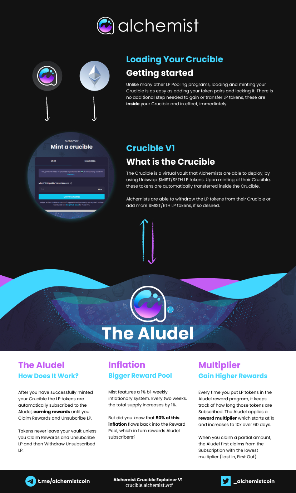

# 视图指南 🎞

### **视频 🎬📺**


请注意，有些视频可能已经过期，所展示的外观与目前现网的  [crucible.alchemist.wtf](http://crucible.alchemist.wtf/) 可能有所不同。另外，这些视频都是由社区制作——尽管如此，我想它们仍然可以对您有一定的帮助。



视频中提到的 Uniswap 可能也已过时。请确保你使用的是 **Uniswap V2** 来提供流动性，因为 V3 不支持参予奖励计划。

如果您不知道如何在 V3 和 V2 之间切换，请直接使用我们[指南](../acquiring-and-subscribing.md)中的链接。


* [Alchemist YouTube Channel](https://www.youtube.com/channel/UCIs4LugynLei2TN__lJh-6Q)
* [Learn how to Mint an Alchemist Crucible](https://www.youtube.com/watch?v=SnnA4NBluDI)
* \(old website\) [制作一个 Crucible](https://www.youtube.com/watch?v=Rl9Rf-3Sp-8)
* \(old website\) [获取 LP ，然后制作一个 Crucible](https://www.youtube.com/watch?v=Ga1qcQ6x3as)
* \(old website\) [获得 LP，然后制作一个 Crucible 并成为 Discord 上的认证 Alchemist](https://www.youtube.com/watch?v=k7MO1QpqCds)
* \(old website\) [使用 Alchemist website 和 OpenSea.io 进行坩埚转移](https://www.youtube.com/watch?v=i2MCYimelBM)
* \(old website\) [无偿损失——在质押 LP 之前关注](https://www.youtube.com/watch?v=8XJ1MSTEuU0)

### **图片 🖼🎨**

