# Introducing new features & Aludel v1.5

## Guide Contents

1. [Using your Crucible as a Smart Wallet/Vault](crucible/guides-crucible.alchemist.wtf/introducing-new-features-and-aludel-v1.5.md#using-your-crucible-as-a-smart-wallet-vault)
2. [Viewing your individual subscriptions performance](crucible/guides-crucible.alchemist.wtf/introducing-new-features-and-aludel-v1.5.md#2-viewing-your-individual-subscriptions-performance)
3. [Claiming rewards and Unsubscribing from a reward program](crucible/guides-crucible.alchemist.wtf/introducing-new-features-and-aludel-v1.5.md#3-claiming-rewards-and-unsubscribing-from-a-reward-program)
4. [Taking part in the New Aludel](crucible/guides-crucible.alchemist.wtf/introducing-new-features-and-aludel-v1.5.md#4-taking-part-in-the-reward-program)

## 1. Using your Crucible as a Smart Wallet/Vault

We've now made it easier for you to manage assets by using your Crucible via [crucible.alchemist.wtf](https://crucible.alchemist.wtf)

You can easily transfer ERC20 tokens in and out of your Crucible and use your Crucible as a Vault.

This also means moving around your assets is much easier as you can easily transfer a Crucible full of tokens to another wallet with a single transaction.

### Viewing your Crucible Contents

1. Locate your crucible, and click the arrow on the right  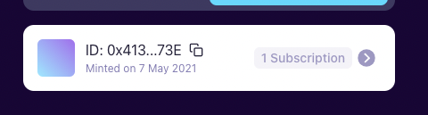  
2. Click on the "Inventory" tab  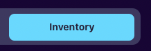  
3. You can now view your "Locked assets" and "Unlocked assets" in a simple form.  **Locked assets** are tokens that have been subscribed to a reward program. **Unlocked Assets** are tokens sitting in your Crucible that are not subscribed to any program and are free to be transferred.   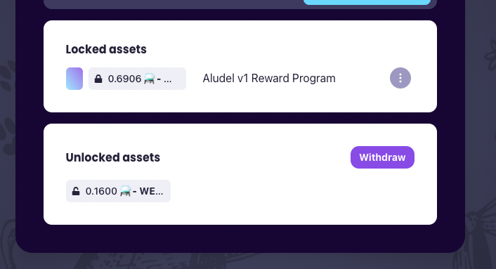  
4. Clicking on "View" on any of your locked assets will bring you to the Reward Program that your asset has been locked to. 
5. Clicking on "Withdraw" will bring you to the Transfer tab where you can move your assets around.

### Transferring in or out of your crucible

1. Locate your crucible, and click the arrow on the right    
2. The first page you should be presented with is the "Transfer" page.  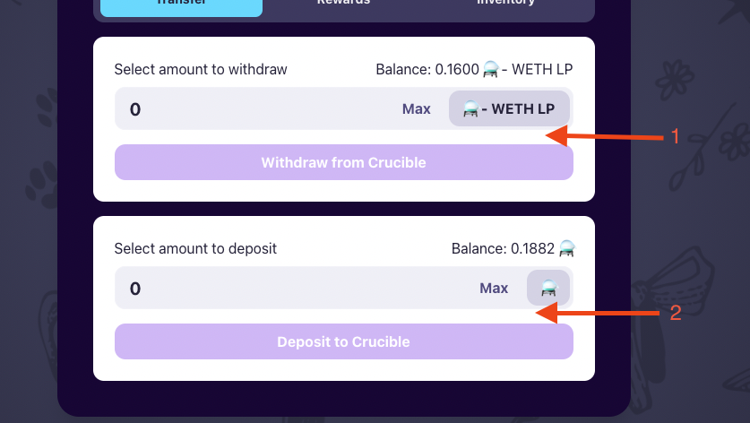   1: This section represents tokens within your Crucible that can be withdrawn 2: The second section represents tokens within your wallet that can be deposited to your Crucible  You may be presented with a message instead, this would mean that you either have no unlocked tokens available for withdrawing, or you have no tokens in your wallet available for transferring to your Crucible, this may be shown as below: 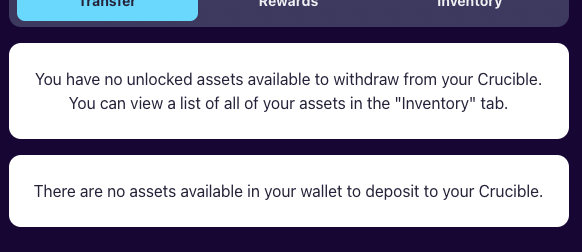   Tokens subscribed to reward programs are not available for withdrawal, you can view all your locked tokens on the "Inventory" tab. 
3. If withdrawing from your Crucible, use section 1 from step 2 and select the token that you wish to withdraw from the box at the end of the import form. **For Depositing to your Crucible, please skip to step 8.** 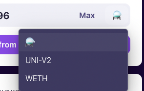  
4. Enter the amount you wish to withdraw and click "Withdraw from Crucible"  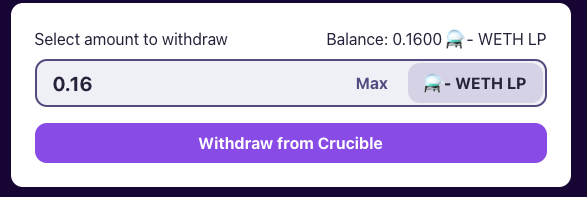  
5. Confirm the transaction. 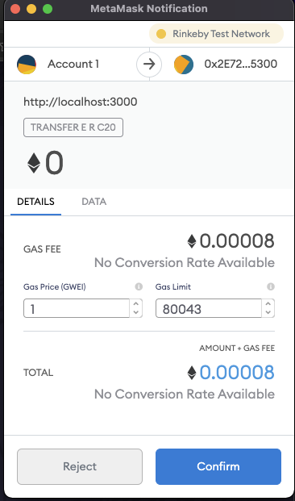  
6. You will receive a confirmation once this process has been successful. 
7. The token you have transferred will now be in your wallet. 
8. If depositing tokens into your Crucible, use section 2 from step 2 and select the token that you wish to deposit from the box at the end of the import form. The tokens available in this screen are populated from the tokens available in your wallet. **For Withdrawing from your Crucible, please go back to step 3.** 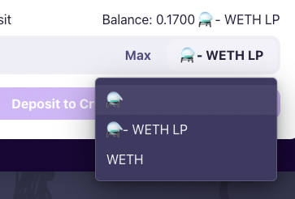 
9. Enter the amount you would like to deposit and click 'Deposit to Crucible' 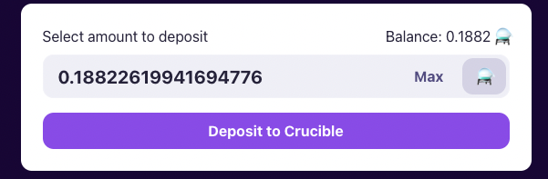  ****
10. Confirm the transaction 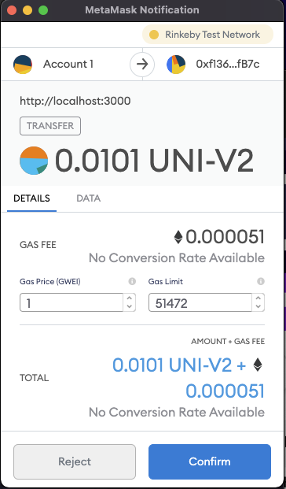  ****
11. The token will now be transferred into your Crucible and can be viewed in the 'Inventory' tab.

## 2. Viewing your individual subscriptions performance

You can now see the performance of your individual subscriptions, so you can keep a better track of your rewards.

We've built the page in a way that you have a summary of each subscription and you can further expand it in order to see the individual rewards.

1. Locate your crucible, and click the arrow on the right    
2. Click on the "Rewards Tab"  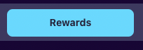  
3. Chose the Reward Program you wish to view from the Purple Dropdown menu  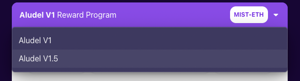 
4. Scroll down to "Subscriptions"  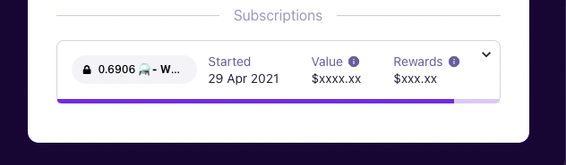   You can now see your individual subscriptions at an overview, and see how they are performing in terms of rewards, the purple bar at the bottom of your subscription represents your multiplier growth against the scaling period. 
5. Expand the individual subscription you wish to view, the exact rewards you have earned in that subscription  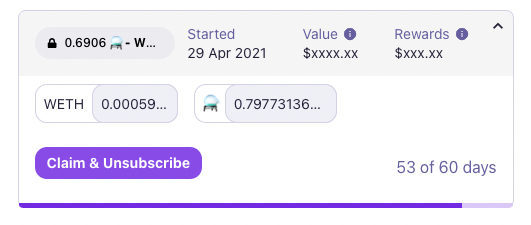   You can now also see the amount of days your subscription has existed for.

## 3. Claiming rewards and Unsubscribing from a reward program

Claiming rewards has slightly changed in order to give you a better visual representation of what you are unsubscribing. Due to the way our reward programs work, subscriptions must be claimed on a **last in - first out** basis. 

1. Locate your crucible, and click the arrow on the right    
2. Click on the "Rewards Tab"    
3. Chose the Reward Program you wish to view from the Purple Dropdown menu 

     

4. You can now view your current subscriptions that are made in the reward program.  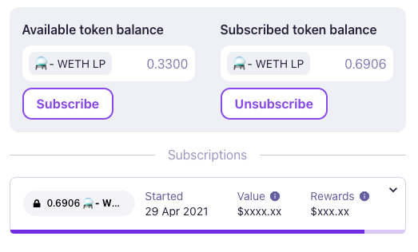  
5. You can either expand the subscription that you wish to unsubscribe and click "Claim and Unsubscribe" or you can click the "Unsubscribe" button on the Subscribed token balance section. 
6. You will be presented with an Unsubscribe dialogue.  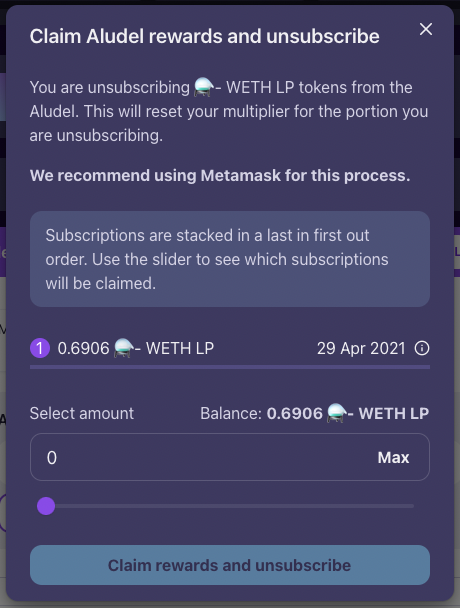   Use the slider to chose how much of your subscription you want to unsubscribe.  **Please note:** - Unsubscribing will claim your rewards for the portion of the token that you unsubscribe. - Subscriptions must be withdrawn on a last in - first out approach 
7. Click 'Claim rewards and unsubscribe' and follow the wallet signing requests to claim your rewards.

## 4. Taking part in the new Aludel v1.5

There is no correct way to do this next step.

You may already be subscribed to the old program. You do not have to claim your rewards and unsubscribe from it to join the new program but you might find it be better to do so as Inflation is no longer being paid into the program. To unsubscribe from the old Aludel, please follow [part 3 above](crucible/guides-crucible.alchemist.wtf/introducing-new-features-and-aludel-v1.5.md#3-claiming-rewards-and-unsubscribing-from-a-reward-program).


There is a possibility that your reward value may change while remaining in the old Aludel after 23/06/2021.


### Joining the new aludel

1. Locate your crucible, and click the arrow on the right    
2. Click on the "Rewards Tab"    
3. Chose the New Reward Program \(Aludel v1.5\) from the Purple Dropdown menu    
4. You will now see that your Available token Balance represents your balance within your Wallet and your Crucible, including your tokens Locked to the Aludel v1. 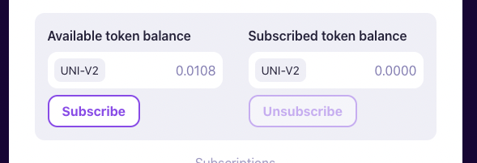  
5. Click Subscribe and a dialogue will pop up.  
6. Choose whether you wish to subscribe from the balance in your Crucible or your Wallet. Tokens subscribed from your wallet will be automatically transferred into your Crucible. Tokens that are already within your Crucible will be locked against the program. 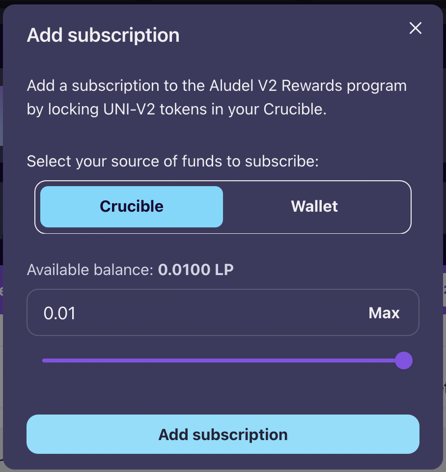  
7. Click "Add Subscription" 
8. You will be presented with a signing request and transaction request, please confirm these. 
9. You will receive a notification when your subscription has been successful and your new subscription will now show up on the Reward program page. 

