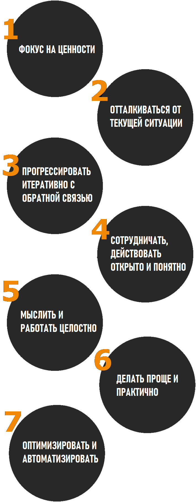

# С чего начать? - 7 Руководящих принципов ITIL \(thegostep\(s\);\)\)!

Руководящий принцип - это рекомендация, которая обеспечивает универсальное и устойчивое руководство для проекта и является основой в любых обстоятельствах, независимо от изменений целей, стратегий, типа работы или структуры управления проекта.

### **1. Фокус на ценности**

Вся деятельность проекта должна быть сосредоточена на создании ценности для “пользователей”, самого проекта и других заинтересованных сторон. ****Во-первых, необходимо определить кто является вашими пользователями и ключевыми заинтересованными сторонами для которых создается ценность. Во-вторых, важно понять, что представляет из себя ценность для пользователей. Также необходимо изучить опыт взаимодействия пользователя с проектом и продуктом/сервисом посредством четкой информированности

* Будьте информированы, как используется ваша услуга/продукт/проект.
* Стимулируйте членов команды фокусироваться на развитии ценности.
* Фокусируйтесь на ценности даже в процессе оперативной деятельности.
* Внедряйте инициативу по развитию фокуса на ценности.

###  **2. Отталкиваться от текущей ситуации**

Не начинайте поиск новых путей развития без анализа вашей текущей ситуаций и возможностей. Не стоит тратить время впустую, разрушая основу вашей работы - подумайте, сколько всего было вложено \(деньги, время и пот\).

Необходимо корректно интерпретировать информацию о текущих услугах и методах, для того чтобы понимать, что можно использовать повторно. Информация всегда должна быть максимально точной для принятия объективных решений. Всегда считайте полученные данные опорой для анализа. Имейте ввиду: анализ полученные данных используется для поддержки услуги или метода, а не для замены, поскольку чрезмерная зависимость от аналитики данных и отчетности может непреднамеренно внести предвзятость и риски в процесс принятия решений.

* Отправной точкой является либо “пользователь”, либо результат. Оценивайте существующие методы как можно более объективно!
* Вы нашли успешные методы развития? Используйте их! Проанализируйте возможности повторов применения для достижения желаемых целей.
* Оценивайте с точки зрения риск менеджмента. 
* Посмотрите правде в глаза! Практически ничего не может быть повторно использовано.

### **3. Прогрессировать итеративно с обратной связью**

Не пытайтесь сделать все сразу. Делите задачи! Благодаря разделению на шаги или этапы \(итерации\), вы сможете не просрочить ни одну задачу. каждую цель будет легче достигать, она будет мотивировать, а не вгонять в депрессии. Фокус на каждом этапе будет более четким. Не упускайте из виду любые изменения, для того чтобы корректно переоценивать каждый этап, а также всю инициативу по развитию.  Честная обратная связь - это ваш инструмент для анализа ваших действий - анализа ваших возможностей улучшения, рисков и проблем. Придавайте отзывам ценность, чтобы учиться, создаавть и улучшаться.

* Маленькими шагами и вехами достигать большие цели.
* Обратная связь необходима - обстоятельства меняются быстро.
* Быстро =/= неполноценно.

### **4. Сотрудничать, действовать открыто и понятно**

Привлечение нужных людей к правильным ролям делает усилия более результативными\( обсуждение при принятии решений имеет большую ценность\) и приводит к успеху в долгосрочной перспективе.  Добавлять участников, как правило, лучше, чем исключать, поскольку энтузиазм, творческие решения и важные перспективы могут быть получены из неожиданных источников.  Для успеха требуется: информация, понимание и доверие.

Выявление всех заинтересованных сторон или групп и взаимодействие с ними.  Наиболее очевидная группа заинтересованных сторон - это «клиенты», поэтому в ITIL основная цель организации - способствовать достижению результатов для клиентов.  К другим примерам сотрудничества с заинтересованными сторонами относятся: разработчики \(сотрудничество с другими внутренними командами - например, исследования\) или внутренние и внешние поставщики.

Необходимо понимать какой вклад в развитие вносит каждая группа заинтересованных сторон на каждом уровне, а также наиболее эффективные методы взаимодействия с ними.  Ждите возможностей сотрудничества разного уровня и типа, основываясь на отношениях между организацией и «клиентом». Учитывайте потребности заинтересованных сторон!  Определите типы, способы и частоту таких сообщений!  И настоятельно рекомендуем действовать согласованно.

Заинтересованным сторонам необходимо иметь четкое видение прогресса и рабочей нагрузки!  Никогда не создавайте впечатление, что ничего не происходит!  Недостаточная прозрачность приводит к принятию неверных решений и влияет на способность улучшать внутренние возможности.  Для избегания этого вам понадобится критический \(и искренний!\) анализ рабочего процесса, узких мест и избыточных усилий.

* Сотрудничество = / = консенсус
* Говорите вслух - лучше чаще общаться
* Хорошие решения можно принимать только в открытом формате.

### **5.  Мыслить и работать целостно**

В комплексной системе изменение одного элемента может повлиять на другие.  Данные воздействия необходимо выявлять, анализировать и планировать.  Ничто не существует само по себе - будь то услуга, практическая деятельность, процесс или отдел.  Если не работать комплексно, то это скажется на результате, поэтому необходимо действовать с учетом целого, а не отдельных частей.

Комплексный подход к принципам ITIL предполагает понимание того, как все части организации работают вместе \(четыре аспекта: организации и люди, информация и технологии, партнеры и / или поставщики, создание ценности и процессы\).  Спрос охватывается и преобразуется в результаты.

* Признайте комплексность каждого элемента.
* Сотрудничество - ключ к слаженной работе.
* Найдите закономерности в потребностях заинтересованных сторон и во взаимодействиях между ними.
* Автоматизация поможет работать слаженно.

### 6. **Делать проще и практично**

Всегда старайтесь достигать целей минимальным количеством шагов. Мышление, ориентированное на результат, следует использовать для выработки практических решений, которые могут дать ценные результаты.  Если процесс, действие или показатель не привносят ценности или полезного результат - уберите их.  Не обращайте внимание на каждое исключение из правил, это автоматически приведет к чрезмерному усложнению.  Вместо этого следует разрабатывать правила, рабочие процессы или процессы устранения исключений в целом.

Ваша цель -  создавать ценность, ставя целью простоту и практичность.  Составьте и делитесь с другими целостным взглядом на работу.  Отдельные команды или группы должны понимать, как на их работу влияют другие, и наоборот - как их работа влияет на других.

Не упускайте из виду противоречащие цели при планировании, управлении или использовании.  Например, менеджерам может потребоваться много данных \(в количественном выражении\), но у сервисных групп могут быть ограничения в определении приоритетов сбора и детализации этих данных.  Найдите компромисс между конкурирующими целями.

* Привносите ценность.
* Простота - ключ к успеху.
* Установите только несколько правил, которые будут охватывать основные действия.
*  Уважайте время и труд вовлеченных людей.
*  Адаптация проходит проще, когда не усложняешь.
*  Лучше синица в руках, чем журавль в небе
* Получить то, что достается без особого труда

###  7. **Оптимизировать и автоматизировать**

Максимизируйте ценность, получаемую в результате  человеческих и технических ресурсов.  Технологии могут помочь проектам расширяться и выполнять частые и повторяющиеся задачи.  Однако не всегда следует полагаться на технологии без возможности вмешательства человека, поскольку автоматизация ради автоматизации может увеличить затраты и снизить надежность и устойчивость.

Оптимизация направлена ​​на то, чтобы все процессы были максимально эффективными и полезными.  Сначала подумайте как можно оптимизировать процессы, прежде чем начинать автоматизацию.  Учтите, что нужно устанавливать ограничения в оптимизации!  Иначе деньги, время или ресурсы могут быть потрачены впустую.

Путь к оптимизации состоит из следующих общих шагов:

*  Определите контекст, в котором движется предлагаемая оптимизация.
*  Оцените отправную точку предлагаемой оптимизации.
*  Сосредоточьтесь на желаемом результате в оптимизации.  Устанавливайте лимиты!
*  Убедитесь, что оптимизация приемлема для всех участников,
*  Помните про итерации, оптимизации, и что всем участникам нравится то, что легко получить.
*  Отслеживайте влияние / эффект оптимизаций.

Автоматизация обычно относится к использованию технологий , помогающих в точности выполнения шага или серии шагов.  Установите автоматизацию в контексте стандартизации и оптимизации рутинных задач.  Например.  определить правила, позволяющие принимать решения без индивидуальной проверки.  Сократите участие человека и оценку каждой части процесса, чтобы добиться большей эффективности.  Автоматизация - это возможность снизить затраты, уменьшить количество человеческих ошибок и \(что важно!\) улучшить впечатления участников.

* Optimization &gt;&gt;&gt;&gt; Automation
* Используйте автоматизацию для повышения качества обслуживания, уменьшения количества ошибок и экономии средств, времени.
* Установите свои метрики.
*  При использовании этих принципов не забывайте про другие руководящие принципы!

