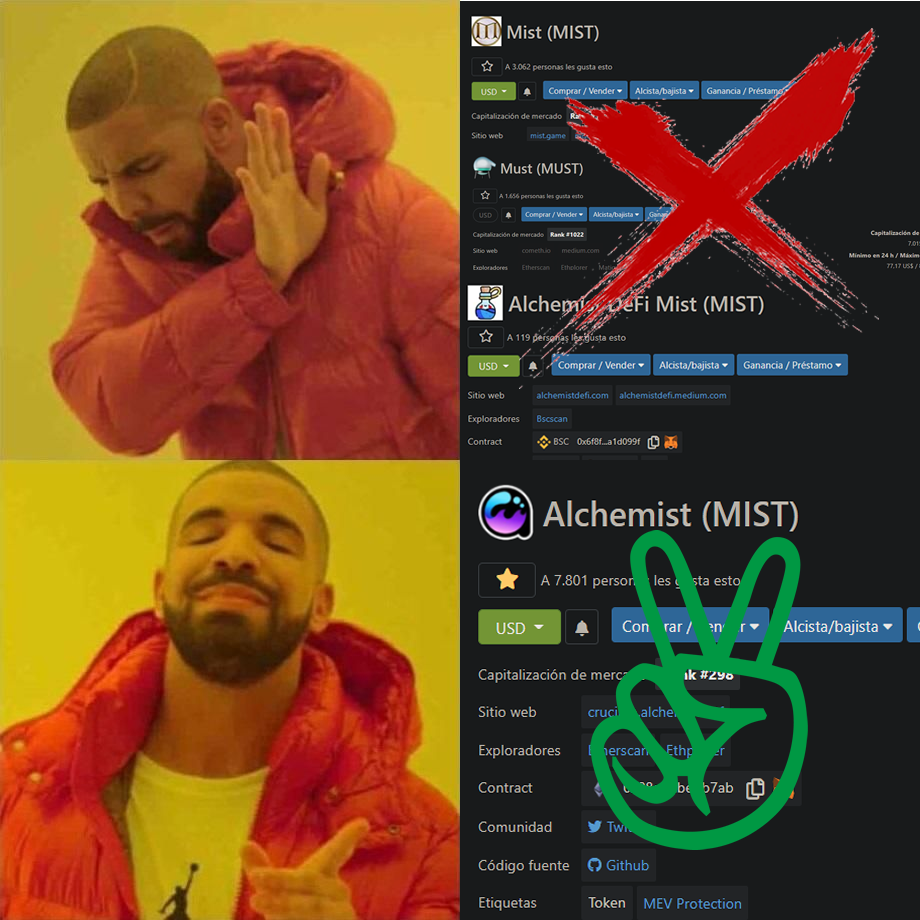

# המתווה הבסיסי

יש אסימון שנקרא [Alchemist](https://etherscan.io/token/0x88acdd2a6425c3faae4bc9650fd7e27e0bebb7ab). הוא מזוהה עם הסמל הזה "⚗️". הוא מכונה גם "mist" ו "MIST$". אל תבלבל את זה עם [Mist \(MIST\)](https://www.coingecko.com/en/coins/mist), [Alchemist DeFi Mist \(MIST\)](https://www.coingecko.com/en/coins/alchemist-defi-mist), ו- [Cometh \(MUST\)](https://coinmarketcap.com/currencies/cometh/) - על אף הסמל האלמבי ⚗️ והשמות הדומים שהוא מציג כעת אין לו שום קשר ל- Alchemist \(MIST\).

בשביל מה ⚗️ טוב? אני לא כאן כדי לענות על זה. אנא עיין כאן [offici](faq.md)[al FAQ](faq.md)

אתה יכול לבצע סטאקינג עם מיסט ⚗️ כמו עם מטבעות אחרים, ובסופו של דבר אתה יכול להשתמש בזה כדי לבצע [mint Crucible NFTs](crucible/teach-me-about-crucibles.md) בתוך התוכנית של [Aludel](the-basic-outline.md#3-aludel).

## כיצד אוכל להגדיל את ההכנסות שלי בשימוש עם מיסט ⚗️ ?

### 1. ספקולציות 

הדרך הראשונה היא לשער את ערכו. במילים אחרות: אתה קונה כמה ומקווה שהמחיר יעלה ואז מוכר אותו. הצהרה: אין התחייבות שהמחיר יעלה.

### 2. סטקינג


קרושיבל \(Crucible\) תומך רק בבריכת הנזילות של Uniswap V2. הוספת נזילות לבריכת V3 של Uniswap אינה תואמת לתוכנית התגמולים.


הדרך השנייה היא לעשות סטקינג במאגר נזילות לצד חלק ערכי שווה של אתריום \(ETH\). כשתעשה זאת תקבל אסימונים של בריכת נזילות \(LP\) המייצגים את חלקך במאגר זה. בסופו של דבר אסימוני LP אלה משמשים כדי למשוך את המיסט ⚗️ ****והאתריום המקוריים שלך מהבריכה כשאתה מחליט שאתה מסיים עם זה.

מאגר הנזילות משמש כדי להקל על עסקאות בין מיסט ⚗️ ל- ETH שאנשים אחרים רוצים לבצע. כל עסקה שנעשתה כרוכה בתשלום קטן עבור העוסק בסחר. בזמן שאתה מחזיק באסימונים של LP, אתה מקבל חלק מאותם עמלות, ביחס ל- LP שאתה מחזיק ביחס לסך ה- LP. \(לדוגמא, אם ה- LP שלך מהווה 1% מסך ה- LP, אתה מקבל 1% מדמי הבריכה\)

רווח זה ממנגנון עמלות של בריכת הנזילות אינו שונה מלבצע סטקינג למטבע אחר לכל מאגר נזילות אחר. ככזה, הוא חשוף ל- "הפסד בלתי-קבוע" לפיו בתור סטקר אתה מפסיד כסף על ידי משיכת המטבעות שנמצאים בסטקינג לאחר שהערך היחסי שלהם השתנה מאז שנרשמת אליהם. אם אינך מכיר את המושג הזה אנו ממליצים לך לערוך מחקר נוסף עד שתבין אותו - יש הרבה משאבים ברחבי האינטרנט שמסבירים את זה טוב יותר מאיתנו.



### 3. אלודל

כאן מתרחשת האלכימיה. "Aludel" הוא שמה של תוכנית התגמול בה תוכלו להרוויח מיסט ⚗️ ו- ETH על כך שנרשמתם אליה באמצעות אסימוני LP ב- crucible.

תוכל ללמוד עוד על crucible בדף זה - "[Teach me about Crucibles](crucible/teach-me-about-crucibles.md)"

